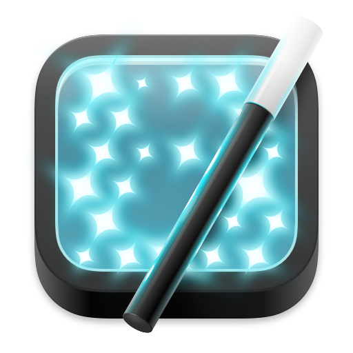

# Badge Wizard
A native macOS App written in SwiftUI to controll [FOSSASIA’S BadgeMagic LED 44×11 matrix displays](https://badgemagic.fossasia.org). The App may work with other badges too. You can create, preview, and send custom messages and animations to the LED badge over Bluetooth.

## Features
- Create and edit multiple messages
- Control builtin animation modes and effects
- Real-time LED matrix preview
- Simple Bluetooth connection to your badge
- Native interface for macOS

## Current Status
This project is in early development. More features and improvements coming soon.

## Credits
The app is inspired by the [firmware](https://github.com/fossasia/badgemagic-firmware) and [Flutter App](https://github.com/fossasia/badgemagic-app), open sourced by FOSSASIA.
